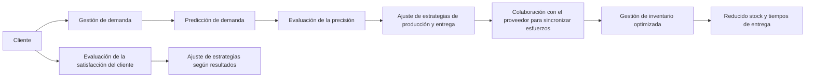
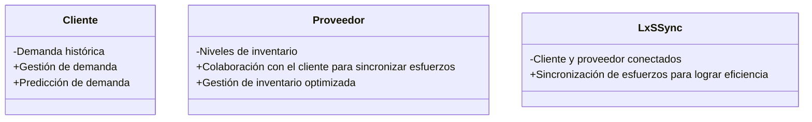

```mermaid
stateDiagram-v2
    title Estados del modelo LxSSync
    
    nota left de "Cliente"
        -Demanda alta
        -Satisfacción baja
    endnota
    
    nota right de "Proveedor"
        -Inventario bajo
        -Tiempo de entrega alto
    endnota
    
    estado "Sincronización" as S
        nota del lado izquierdo
            -Cliente y proveedor colaboran para sincronizar esfuerzos
        endnota
        nota del lado derecho
            -Gestión de inventario optimizada
            -Tiempo de entrega reducido
        endnota
    
    estado "Evaluación" as E
        nota del lado izquierdo
            -Satisfacción del cliente evaluada
            -Ajuste de estrategias según resultados
        endnota
```